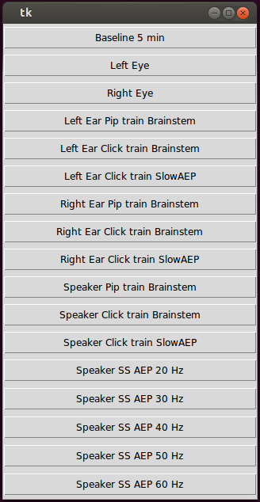

Easter
======

The gui.py script can be used to call the other scripts, and that's the recommended way of launching them. The scripts are divided into VEP and AEP. There is also baseline_5m.py which is used to record a 5 minute baseline signal.
All the scripts write the recorded data in /media/ssd/ and currently this address is hardcoded, Mosalam will fix this in the new version so the address is in a common config file.

Visual Evoked Potential (VEP)
-----------------------------

These scripts need the arduino, which is/will be documented in the lab's wiki by Mosalam and he will update this reame with the details.

Auditory evoked potentials (AEP)
--------------------------------

The audio signals are pre-generated in wav format and these script play these sound files. For the speaker vs headphone experiments should make sure in the OS the sound is sent to the right device as this is much easier than doing so in a software mixer reliably.

